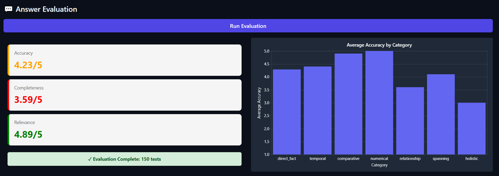

# InsureLLM RAG Challenge: The LLM Context Compression Approach

This document outlines the architecture of my high-performance **RAG (Retrieval-Augmented Generation)** pipeline, which was optimized through a systematic, data-driven process.

The final architecture is a **Two-Stage Retrieval Pipeline** (using a Bi-Encoder and a Cross-Encoder) that is coupled with a **Relevance-Prioritized Truncation** strategy.  
This strategy strictly enforces a **5,000-character context limit** using a **second LLM call** as an intelligent *compression* step. It instructs the LLM to synthesize only the most relevant information from the retrieved chunks, creating a single, dense context under the 5,000-character limit.

---

## Data-Driven Diagnosis: Why This Architecture?

My design directly evolved from the empirical results of multiple evaluation phases.

### The Baseline Failure

The initial "naive" RAG (using simple chunking and basic vector search) failed on complex queries.

The baseline pipeline was:
1. Fragmenting coherent information during indexing.  
2. Failing to retrieve the right information for complex questions.
---

### The Indexing Fix

We replaced the `RecursiveCharacterTextSplitter` with `SemanticChunker`, which groups sentences based on meaning rather than character count.

- **Partial Success:** "Holistic" Accuracy improved from 2.6 → 3.4 / 5  
- **Critical New Failure:** **MRR dropped from 0.7228 → 0.6667**

This proved that **better chunks hurt retrieval** when the retriever (bi-encoder) was too weak to rank nuanced semantic representations.

---

### The Retrieval Solution

To solve the 0.6667 MRR, we implemented a **Two-Stage Retrieval System**:

1. **Stage 1 – Bi-Encoder (Fast Recall):**  
   Model: `all-MiniLM-L6-v2`  
   Retrieves a large (k=50), high-recall candidate list.
2. **Stage 2 – Cross-Encoder (High Precision):**  
   Model: `BAAI/bge-reranker-base`  
   Reranks candidates to select the top_n=3 most relevant documents.

**Results:**
- **MRR:** 0.6667 → **0.9058**
- **nDCG:** 0.6873 → **0.9049**
- **Answer Accuracy:** 3.81 → **4.42 / 5**

This validated that our retriever now yields a *high-confidence* ranking of relevant documents.

---

## The 5,000-Character Constraint & Solution

This method solves the 5,000-character constraint.

### The Compression Call

- Retrieve the top 3 documents using the cross-encoder re-ranker (`BAAI/bge-reranker-base`).
- Pass all 3 to a **compression LLM** via a `COMPRESSION_PROMPT`.
- The LLM synthesizes a single dense, query-specific text block under 5,000 characters.

### Step 2: The Generation Call

- Feed the compressed text into the final `SYSTEM_PROMPT`.
- The LLM then generates the final answer based only on the **distilled, relevance-aware** context.

---

### `ingest.py`

The `RecursiveCharacterTextSplitter` was replaced with `SemanticChunker`.

```python
from langchain_experimental.text_splitter import SemanticChunker
from langchain_huggingface import HuggingFaceEmbeddings

embeddings = HuggingFaceEmbeddings(model_name="all-MiniLM-L6-v2")

def create_chunks(documents):
    text_splitter = SemanticChunker(embeddings)
    chunks = text_splitter.split_documents(documents)
    return chunks
```
---

### `answer.py`

Implements the `Two-Stage Retriever` and `LLM Context Compression` logic.

```python
from langchain_classic.retrievers.contextual_compression import ContextualCompressionRetriever
from langchain_classic.retrievers.document_compressors.cross_encoder_rerank import CrossEncoderReranker
from langchain_community.cross_encoders import HuggingFaceCrossEncoder

# Compression Prompt
COMPRESSION_PROMPT= """You are a highly intelligent text analysis assistant.
You will be given a user's query and several context chunks retrieved by a search system.
Analyze them and extract ONLY the information relevant to answering the query.

Synthesize this information into a single, coherent, dense block of text.
The output MUST be under 5000 characters.

If no relevant information exists, respond with exactly: "NO_RELEVANT_INFORMATION".

Context Chunks:
{context_chunks}

User Query: {question}

Relevant Information (under 5000 chars):"""

# --- Two-Stage Retrieval Setup ---
vectorstore = Chroma(persist_directory=DB_NAME, embedding_function=embeddings)
base_retriever = vectorstore.as_retriever(search_kwargs={"k": 50})
model_name = "BAAI/bge-reranker-base"
cross_encoder = HuggingFaceCrossEncoder(model_name=model_name, model_kwargs={'device': 'cpu'})
compressor = CrossEncoderReranker(model=cross_encoder, top_n=3)
retriever = ContextualCompressionRetriever(base_compressor=compressor, base_retriever=base_retriever)

# --- LLMs ---
llm = ChatOpenAI(temperature=0, model_name=MODEL)
compression_prompt = ChatPromptTemplate.from_template(COMPRESSION_PROMPT_TEMPLATE)
compression_chain = compression_prompt | llm | StrOutputParser()

def fetch_context(question: str) -> list:
    print(f"\n--- FETCHING CONTEXT FOR: '{question}' ---")
    docs = retriever.invoke(question)
    print(f"Retrieved {len(docs)} re-ranked documents.")
    return docs

def answer_question(question: str, history: Optional[List] = None) -> Tuple[str, List]:

    # Step 2: LLM Compression
    print(f"\n--- COMPRESSING CONTEXT ---")
    context_for_compression = "\n\n---\n\n".join(getattr(doc, "page_content", "") for doc in docs)
    compressed_context = compression_chain.invoke({"context_chunks": context_for_compression, "question": question})

    if "NO_RELEVANT_INFORMATION" in compressed_context or not compressed_context.strip():
        return "No relevant information found after compression.", docs

    final_context = compressed_context[:MAX_CONTEXT_LENGTH]
    print(f"Final compressed context length: {len(final_context)} characters.")

    # Step 3: Final Answer Generation
    system_prompt = SYSTEM_PROMPT.format(context=final_context)
    messages = []
    messages.extend(convert_to_messages(history))
    messages.append(HumanMessage(content=question))
    response = llm.invoke(messages)
    return response.content, docs
```

---

## Results

*(Add your result images below — replace these placeholders with actual paths once available.)*

### Retrieval Evaluation


### Answer Evaluation



---

## Installation

Please install the required packages before running the pipeline:

```bash
uv sync
uv pip install langchain-experimental langchain-classic langchain-community
```
